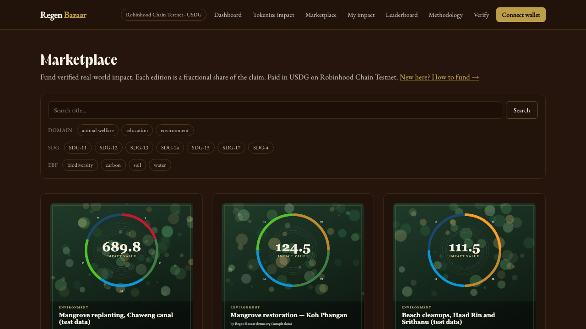
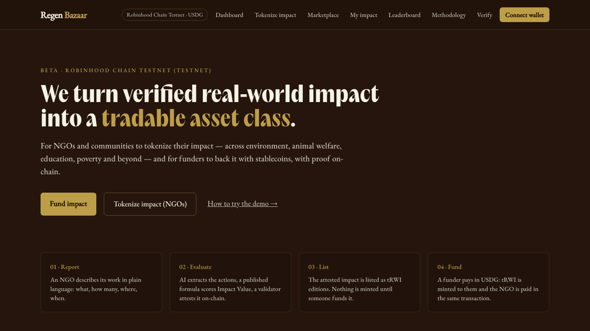
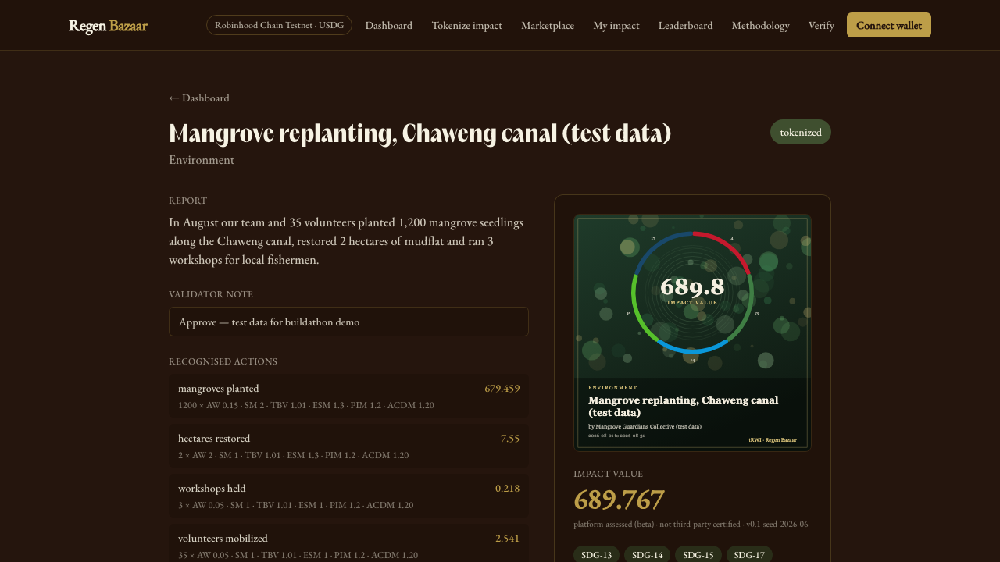
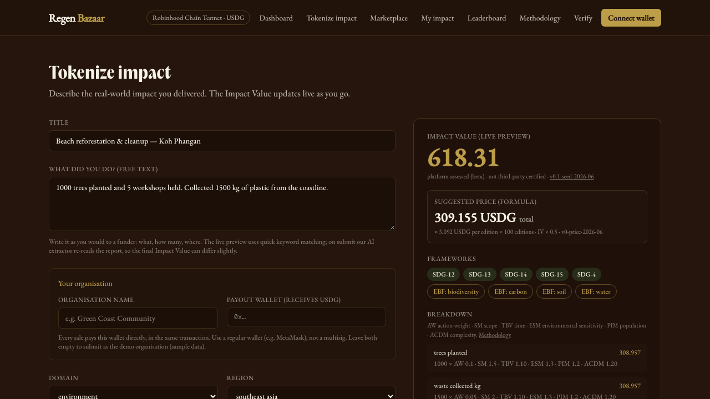

  

<h1 align="center">Regen Bazaar</h1>

  <b>Fund verified real-world impact on-chain, paid in USDG, with provenance anyone can check.</b>

  <a href="https://app.regenbazaar.com"><b>Try the beta</b></a> ·
  <a href="https://github.com/Regen-Bazaar/regenbazaar-beta">Source</a> ·
  <a href="https://github.com/Regen-Bazaar/regenbazaar-beta/blob/main/docs/ARCHITECTURE.md">How it works</a> ·
  <a href="https://app.regenbazaar.com/roadmap">Roadmap</a> ·
  <a href="https://www.regenbazaar.com">Website</a> ·
  <a href="https://x.com/RegenBazaar">X</a> ·
  <a href="https://t.me/regen_bazaar">Telegram</a>

  

> **Status:** public beta on testnets: Arbitrum Sepolia and Robinhood Chain testnet in the app, plus Celo Sepolia, where Regen Bazaar started. No real funds, no production users yet.

## What it is

Small NGOs and community groups do measurable good: reforestation, cleanups, animal rescue, education. They rarely have a way to turn that work into something a funder can buy, hold and verify.

Regen Bazaar turns an NGO's impact report into **tRWI** (tokenized real-world impact): fractional ERC-1155 editions backed by an on-chain attestation. Funders pay in **USDG**, and the NGO is paid in the same transaction.

## How it works

1. **Report.** An NGO describes its impact in plain language. An LLM extracts the actions and numbers; it never scores.
2. **Score.** A deterministic, versioned formula computes the Impact Value. Weights are v0.1, published at [`/methodology`](https://app.regenbazaar.com/methodology), platform-assessed, not third-party certified.
3. **Verify.** A human validator approves. Metadata is pinned to IPFS and the claim is attested on-chain with EAS.
4. **Fund.** A funder buys editions in USDG. The token is lazily minted at purchase from a platform-signed voucher; 97.5% goes straight to the NGO wallet, 2.5% is the platform fee.
5. **Hold or retire.** Editions show up on the funder's **My impact** page and can be retired to claim the impact permanently.

| Home | On-chain proof | Submit impact |
|---|---|---|
|  |  |  |

## Networks and contracts

The same v3 contracts run on three testnets, all source-verified. The site currently offers Arbitrum Sepolia and Robinhood Chain testnet in its network switcher; Celo Sepolia is where the platform was first built and deployed.

| Network | Payment | Sale contract | Example purchase |
|---|---|---|---|
| Celo Sepolia (11142220) | CELO (native) | [`0x2b4A…98B2`](https://celo-sepolia.blockscout.com/address/0x2b4A3aE4E69771cdf2Fd4e2075A7B3Ab2e0498B2) | [`0xce901fd1…`](https://celo-sepolia.blockscout.com/tx/0xce901fd12fceb8f166ddd585f96b5baa1c91e64864608b1c0d5f869bd79b1273) |
| Arbitrum Sepolia (421614) | tUSDG, a labelled testnet stand-in, while the Paxos USDG faucet is not dispensing there; Paxos USDG is already allowlisted | [`0x79E4…9030`](https://arbitrum-sepolia.blockscout.com/address/0x79E4bEAF41F415cE3DF55DaDe3F86423e5399030) | see [deployments](https://github.com/Regen-Bazaar/regenbazaar-beta/blob/main/packages/contracts/deployments/arbitrum-sepolia.json) |
| Robinhood Chain testnet (46630) | Paxos USDG (testnet) | [`0x79E4…9030`](https://explorer.testnet.chain.robinhood.com/address/0x79E4bEAF41F415cE3DF55DaDe3F86423e5399030) | [`0xea4a18d2…`](https://explorer.testnet.chain.robinhood.com/tx/0xea4a18d20c2fc3c4ed2a46ef7681129a99b905118745ff2de9ad95609ca2ba77), 97.5% to the NGO in the same transaction |

All addresses and proof transactions: [`packages/contracts/deployments`](https://github.com/Regen-Bazaar/regenbazaar-beta/tree/main/packages/contracts/deployments).

## Try it

- **Without a wallet:** browse the [marketplace](https://app.regenbazaar.com) and open any project to see its attestation and transactions.
- **For AI agents and developers:** a public machine-readable catalogue at [`/api/impact`](https://app.regenbazaar.com/api/impact).
- **With a wallet:** switch to either testnet, get test tokens (the in-app guide lists working faucets), press *Fund this impact*, then open *My impact*.

## How we got here

- **Before the platform:** two single-organisation pilots of the model: [Clean Phangan](https://cleanphangan.regenbazaar.com) (community beach cleanups on Koh Phangan, impact NFTs on Optimism) and [EcoThailand Foundation](https://ecothailand.regenbazaar.com) (mangrove restoration, on Celo).
- **Jan to Feb 2025:** [Litepaper](https://github.com/Regen-Bazaar/Litepaper) and a first [demo MVP](https://github.com/Regen-Bazaar/Demo-Regen-Bazaar).
- **Spring 2025:** contract prototypes on Stellar (Soroban), Starknet (Cairo) and Move; Gitcoin GG23 (OSS dApps and Apps round).
- **May to Sep 2025:** Celo Proof of Ship, Season 4: EVM contracts deployed to Celo's Alfajores testnet and a Next.js frontend ([contracts-evm](https://github.com/Regen-Bazaar/contracts-evm), [dapp](https://github.com/Regen-Bazaar/dapp)).
- **Jun 2026:** rebuilt from scratch as one monorepo on Celo Sepolia (Alfajores had been retired): Impact Value engine, EAS attestations, lazy-mint vouchers, three contract versions ending in the hardened v3, purchases through the app.
- **Sep 2026:** Arbitrum Open House buildathon: the same v3 contracts on Arbitrum Sepolia and Robinhood Chain testnet, USDG checkout, one site with a network switcher, public beta.

Repositories from 2025 are archived read-only and kept for the record.

## Roadmap

Ordered by priority, no dates. Phases 2 and 3 are the ones we would take on with grant funding.

1. **Public beta and feedback** (now): open testing on both testnets, fix every step where testers get stuck.
2. **Trust: methodology and verification**: expert-calibrated weights, physical units, required evidence, duplicate and cross-registry checks, revocation.
3. **Organisations: onboarding without crypto**: email or Telegram sign-in, organisation profiles, teams, payouts for NGOs new to crypto.
4. **Funders, companies and AI agents**: card and gasless checkout, impact certificates, company portal, documented agent API.
5. **Validator network and community**: open task pool, public track records, disputes.
6. **Mainnet**: external audit, multisig with timelock, legal review, launch with pilot partners.

Full roadmap: [app.regenbazaar.com/roadmap](https://app.regenbazaar.com/roadmap)

## Repositories

- [**regenbazaar-beta**](https://github.com/Regen-Bazaar/regenbazaar-beta): the app, contracts, Impact Value engine and indexer (active)
- [**landing**](https://github.com/Regen-Bazaar/landing): [www.regenbazaar.com](https://www.regenbazaar.com)
- Earlier work (litepaper, demo MVP, Celo contracts, first dApp, Stellar, Cairo and Move prototypes) is archived and kept read-only.
